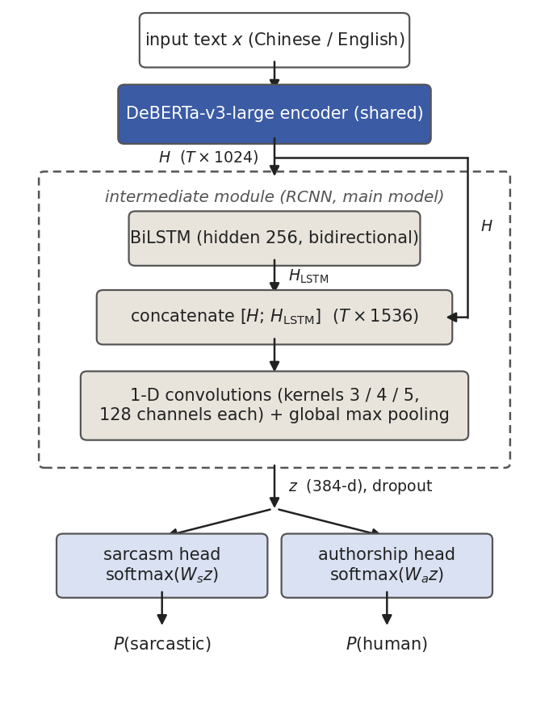
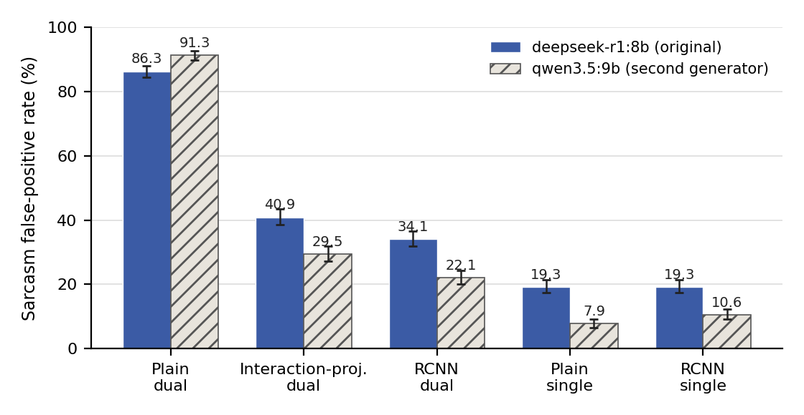

# EACL 2027 投稿稿（中文权威版）

> **投稿注记（翻译/排版前必读，随后删除本块）**
> - **目标**：EACL 2027 主会 **长论文**（经 ACL Rolling Review 投稿，OpenReview；ARR 截止 **2026-08-03 AoE**）。
> - **页数**：正文（含摘要、图表）**≤ 8 页**；Limitations（强制）、Ethics Statement（可选）、References、附录**不计页**。本稿各节已按 8 页预算压缩，翻译为英文后请按节预算核查（预算注在各节标题后的 HTML 注释里）。
> - **模板**：必须使用官方 ACL 样式模板（github.com/acl-org/acl-style-files），禁止改样式文件。附录也须双栏。
> - **匿名化（双向匿名）**：本稿已按 ARR 规则改写——前序工作一律以真实姓名第三人称引用（Yang & Ikeda 2023 / 2024，已入参考文献），**不得**写 "our previous work"。无致谢节。补充材料如附代码需用 Anonymous GitHub。
> - **Limitations 红线**：该节不得引入新方法/新分析/新结果（违者桌面拒稿）；本稿该节仅复述正文已有内容的边界。
> - **Responsible NLP Checklist**：随投稿表单填写，答案草稿见 `submission_checklist.md`。
> - **数字口径**：与 `paper3/manuscript_zh.md`（长版权威稿）完全一致；参考文献〔待核对〕条目（现 9 条）须在投稿前对照原文核实。
> - **数据集命名映射**（论文名 ↔ 内部工件名，发布代码/数据时对齐）：SarcTrain = D_critic_sarcasm；AuthTrain = D_critic_auth；GenTrain = D_actor_sft；DualTest = D_test_dual。长版与项目文档仍用内部名。

---

# 机器生成文本检测的联合训练可能干扰讽刺检测：类条件负迁移的双语诊断

# Joint Training with Machine-Generated Text Detection Can Distort Sarcasm Detection: A Bilingual Diagnosis of Class-Conditional Negative Transfer

## 摘要 <!-- 预算 ~0.35 页 -->

讽刺是一类意图可能偏离表面情感的非字面语言。作为一种以隐含意图和语境为基础、具有鲜明人类表达特征的语言形式，讽刺很难被自动检测。使用 LLM 生成的样本扩充训练数据可能有助于提高检测准确率。然而，这一策略要求 LLM 生成的文本既能传达讽刺意图，又与人类写作相似，因此必须同时评估讽刺性与作者来源。尽管讽刺检测与机器生成文本检测（MGTD）通常被分别研究，二者在共享表征中的相互作用仍缺少系统分析。MGTD 必须编码来源线索，而讽刺检测应反映意图而非来源。本文据我们所知首次对中英文联合 MGTD–讽刺训练开展双语诊断。我们整合双语资源、生成主题匹配的 AI 文本，并构建带有来源与讽刺标签的 DualTest，其中 AI 文本的标签由提示中要求的风格定义。与各自的单任务模型相比，联合训练模型明显更容易将按非讽刺条件生成的 AI 文本误判为讽刺。人类作者身份检测器分数与 LLM 类人度评分对输出的排序也不相同。结果表明，应开展子群评测，并谨慎对待仅依赖检测器的评价。

## 1 引言 <!-- 预算 ~1 页 -->

讽刺是一类典型的非字面表达，其意图可能与表层措辞相反。作为一种具有鲜明人类表达特征的语言形式，讽刺依赖隐含意图、对比、语境与背景知识，因此很难被自动检测；多语言差异与标注不一致进一步加剧了这一问题。

基于 LLM 的数据增广提供了一种潜在应对方式。只有当生成文本既保留讽刺意图、又与人类写作相似时，这种方法才可能有效；否则，来源特有的伪影可能成为模型利用的捷径。因此，必须同时考虑讽刺性与作者来源：人类文本和 AI 生成文本都可能是讽刺或非讽刺的。在实际部署中，“这段文本是否具有讽刺性？”与“这段文本是否由人类写作？”因而可能需要针对同一输入同时回答。

检测器分数在下游同样重要，因为它们可能被用作生成奖励。例如，ViSP 使用讽刺检测器分数构造 PPO 奖励（Wang et al. 2026；§2.4）。然而，有用的讽刺生成需要同时满足两个不同目标：传达讽刺意图，并被感知为像人类写作。双头检测器看似可以通过讽刺概率和人类作者概率提供相应信号，但作者概率本身并不等于类人度。因此，§6 检验这些检测器分数是否与来源盲化的 LLM 讽刺度及感知类人度评分一致。尽管如此，现有工作仍大多分别研究讽刺检测与 MGTD，将二者统一为联合多任务问题的研究仍然缺失（检索协议见 §2.2）。

为了检验这些风险，而不是预设 MGTD 必然是有益的辅助任务，本文在双语数据上比较同架构双头与单头模型，并构建 DualTest 开展来源 × 讽刺子群分析。所评估的联合训练流程大幅提高了按非讽刺条件生成的 AI 文本上的讽刺误报率；本文将其称为类条件负迁移。用 Qwen3.5-9B 重新生成测试集 AI 文本后，该方向仍然出现，两种中间配置的误报率低于朴素配置。通过结合线性 probe、任务头相关性和表征干预，本文识别出子群差距所敏感的一个非随机高方差方向。这些分析支持来源相关捷径假说，并将该有效方向的语义内容界定为后续因果分析的具体目标。

**贡献。** 按论文结构，本文的贡献有四：

- **面向联合检测的双语数据集套件与双头诊断设置（§3–§4）。** 构建四个双语数据集：讽刺训练集 SarcTrain（10,000，全人类）、 MGTD 训练集 AuthTrain（19,995，人类–AI 严格配对）、生成指令集 GenTrain（2,428），以及诊断测试集 DualTest（4,664）。DualTest 每条样本同时标注 `is_sarcastic` 与 `is_human`，支持按"来源 × 讽刺"四象限的类条件分析；据我们所知，它是讽刺评测中双标签分层测试集的首例，其上建立的双头模型也首次将两任务作为联合多任务问题建模（§2.2）。
- **类条件负迁移的行为层诊断（§5）。** 朴素双头把 86.3% 的 AI 非讽刺文本误判为讽刺，而共享同一讽刺监督的单头仅 19.3%。这一上升由完整联合训练流程诱导，差距方向也出现在 Qwen3.5 生成的测试文本上，两种中间配置降低了观测严重程度。
- **表征级刻画与后续因果目标（§5.3.2）。** 来源信息在讽刺表征中高度可解码并与决策相关；概念擦除与正交高方差对照表明预测对一个非随机高方差方向敏感。结果支持来源相关捷径假说，并将该方向的语义内容和来源特异因果作用确定为进一步分析的具体目标。
- **探索性的检测器—评审比较（§6）。** 人类作者概率与 LLM 对感知类人度的评分以不同方式排序生成输出，讽刺分数的一致性也随语言变化。这一延伸分析说明，检测器概率在用作生成质量或奖励信号前需要外部验证。

## 2 相关工作 <!-- 预算 ~0.95 页 -->

### 2.1 讽刺检测与多语言资源

特征工程方法（Riloff et al. 2013）、神经序列模型（Ghosh & Veale 2016；Tay et al. 2018）与预训练语言模型（Khatri & P 2020；Han et al. 2022）均推动了讽刺检测的发展。该任务在多语言和类别不均衡的设置下仍然困难，尤其是标签面向意图讽刺而非感知讽刺时。这些分数不能在数据集、语言、模态和评价设置之间直接比较，但可以说明现有基准的难度与差异：iSarcasmEval（Abu Farha et al. 2022）英文前两名系统的正类 F1 为 0.605 与 0.569；MultiPICo（Casola et al. 2024）各语言上零样本 ChatGPT 的正类 F1 为 0.152–0.567；双语多模态 SarcNet 基准（Yao et al. 2024）中，纯文本 XLM-R 达到 0.734 F1。RCNN 将循环上下文与卷积池化结合用于文本分类（Lai et al. 2015），也曾被用于多语言讽刺检测（Yang & Ikeda 2024）；因此，§4.1 将 RCNN 作为一种中间层配置进行考察。由于上述基准结果来自不同数据集，§5.1 在 DualTest 上提供可直接比较的 mBERT 双头基线。本文使用中英双语设置检验该子群失效是否局限于单一语言，而非将跨语言迁移作为主要目标。

### 2.2 机器生成文本检测与作者身份验证

机器生成文本检测（MGTD）的通用方法包括零样本/困惑度检测器（Mitchell et al. 2023）与在人类--AI 配对语料（HC3，Guo et al. 2023）上训练的判别模型；该领域公认的核心挑战是泛化：M4（Wang et al. 2024）与 RAID（Dugan et al. 2024）分别针对跨生成器、跨领域、跨语言的黑盒检测与检测器的鲁棒评测而设计。概念上，Bevendorff et al.（2025）将该问题定位为作者身份验证（authorship verification）而非质量评估。本文把 MGTD 判断作为共享编码器中的辅助任务。综合来看，既有研究将讽刺检测与 MGTD 视为两个互不相关的问题：现有多任务讽刺研究主要将讽刺与情感、立场或情绪组合，据我们所知，尚无工作将讽刺检测与 MGTD 作为联合多任务问题研究[^search]。两个判断被联合学习时共享编码器如何表现，因此是一个开放问题，也是本文的出发点。

[^search]: 检索于 2026 年 5 月，并于 2026 年 7 月更新，覆盖 Semantic Scholar、arXiv、ACL Anthology 与 Google Scholar，关键词组合含 "sarcasm detection"、"machine-generated text detection"、"AI-generated text detection"、"multi-task learning"、"joint detection"。（译英时排为脚注）

### 2.3 多任务负迁移、捷径学习与共享编码器缓解

本文将负迁移与捷径学习用作解释框架，分析一个此前未被研究的任务组合。多任务学习的既有结论是辅助任务并不总有益：迁移方向取决于任务相关性与数据几何（Zhang et al. 2023；Wu, Zhang & Ré 2020），冲突梯度可导致负迁移（Yu et al. 2020；Liu et al. 2021）。在 NLP 中，Mueller et al.（2022）以单/多任务对照显示模型会从输入分布推断任务身份、在分布外输入上失稳，是与本文最接近的先例（另见 He & Choi 2021；Li et al. 2023 对多任务模型内部机制的分析）。捷径学习提供互补视角：模型可能利用在训练分布中有预测力、但在特定子群上失效的特征（Geirhos et al. 2020；Ye et al. 2024）；在多任务情境下，这表现为更高的伪相关吸收（Hu et al. 2022b；Chai & Wang 2025）与子群分层失败（Compton et al. 2023）。共享编码器的缓解方法要么隔离任务专属参数（Pfeiffer et al. 2020, 2021；Karimi Mahabadi et al. 2021；Stickland & Murray 2019），要么调整共享计算内部的信息流（Wu et al. 2019；Pilault et al. 2021）。本文的分析更接近第二种设计方向：比较无中间模块的基线与两个中间表征变体，并检验退化是否随来源 × 讽刺子群而变化（§5.3）。

### 2.4 基于检测器的评价与奖励失配

在失效诊断的主线之外，双头检测器的输出还可能被用作生成评价或奖励信号；本节回顾这条延伸线，作为 §6 附带分析的背景。LLM-as-judge（Zheng et al. 2023）广泛用于生成评测；将自动评分器用作奖励则有 Goodhart 意义下的奖励攻击风险。这一做法已进入讽刺生成实践：ViSP（Wang et al. 2026）以讽刺检测器 DIP（Wen et al. 2023）的分数作为 PPO 奖励，其数据筛选与部分质量分析也依赖同一检测器，作者亦将"性能依赖外部评价器质量"列为首要局限。如 §2.2 所述，MGTD 的目标是验证而非质量评估，检测器分数与感知质量的一致性因此需要直接检验。§6 检验这一前提，并分析当 MGTD 检测器被用作生成评价信号时评分方向的系统性偏差。


## 3 数据集构建 <!-- 预算 ~0.9 页 -->

我们从 5 个异构来源（iSarcasm：Oprea & Magdy 2020 / Abu Farha et al. 2022；CSC：Jang & Frassinelli 2024 / Jang et al. 2023；ToSarcasm：Liang et al. 2022；News Headlines v2：Misra & Arora 2023 / Misra & Grover 2021；Open Chinese Internet Sarcasm Corpus：Zhu 2022；标准化合并后 44,862 条，英文约 87%）出发，经三阶段管道得到三个训练集与一个诊断测试集；来源明细、标注方式与质量检查见附录 A。

**讽刺分类训练集 SarcTrain（10,000，全人类）。** 按（语言 × 标签）四桶各 2,500 平衡。其中三个桶下采样；中文讽刺桶以 2,396 条记录（对应 2,394 个唯一文本）为基础，新增 104 条过采样记录。最终数据按 5 折组织。

**MGTD 分类训练集 AuthTrain（19,995）。** 人类侧从 SarcTrain 取得 9,999 个近似语言平衡的种子（英文 5,000 / 中文 4,999）；种子级生成质量控制排除了一条中文种子。AI 侧以每条入选人类文本为提示种子，指示 DeepSeek-R1-0528-Qwen3-8B（Ollama 标签 `deepseek-r1:8b`）生成主题相关输出。最终保留 9,996 条 AI 对应文本；3 条入选人类种子没有匹配的 AI 文本，配对覆盖率为 99.97%。四套生成模板（中/英 × 讽刺/正常）按平衡的种子标签选取。作者来源标签与指令要求的风格标签是分别构造、近似平衡的两个因素；本文不假设生成文本的实际特征或感知讽刺性相互独立。生成参数、模板全文与后处理步骤见附录 A。

**生成训练集 GenTrain（2,428，§6 用）。** iSarcasm 与 ToSarcasm 中共有 5,257 条符合条件的讽刺正样本；以种子 42 抽取 2,103 条（英文 1,214、中文 889），再新增 325 条中文过采样记录，使中英各 1,214 条。按提示类型分为改写 374、回答 839、评论 1,215，作为 SFT 指令微调数据。

**诊断测试集 DualTest（4,664）。** 本文数据贡献的核心：每条样本同时带 `is_sarcastic` 与 `is_human` 双标签。人类侧取 iSarcasm 官方测试划分（1,400 英文）与 ToSarcasm 测试集（972 中文）；生成与质量控制后，保留了 2,372 条人类文本中 2,292 条的 deepseek-r1:8b AI 对应文本（覆盖率 96.6%）。人类文本保留原始标注；AI 文本的 `is_sarcastic` 记录生成指令条件，而非对感知讽刺的独立人工标注，`is_human` 则在构造上为否。合并语言后四象限为：人类×讽刺 823、人类×非讽刺 1,549、AI×讽刺 779、AI×非讽刺 1,513（语言 × 来源 × 讽刺分布见附录 A）。

## 4 双头检测模型 <!-- 预算 ~0.9 页 -->

### 4.1 任务与架构

给定一段中文或英文输入文本 $x$，模型输出两个分开且非互斥的二分类预测：$x$ 是否被标记为讽刺，以及其作者来源是否被标记为人类或 AI。两个标签的任何组合都合法。两个任务共享同一个 DeBERTa-v3-large 编码器（He et al. 2023），编码器输出经中间层聚合后，分别送入两个任务特定的分类头；图 1 展示 RCNN 配置。



**图 1：RCNN 双头配置示意。§5 的比较在保留相同编码器主干与任务定义的前提下，于朴素配置中移除虚线组件，或以任务分支交互投影替代（附录 B）。**

RCNN 配置的中间层为 BiLSTM + CNN。单层双向 LSTM 每个方向的隐层维度为 256，因而在每个 token 位置输出 512 维向量。该输出与 1,024 维编码器表征拼接，再经三组一维卷积（核宽 3/4/5，各 128 通道）与全局最大池化聚合为 384 维向量 $z$，经 Dropout 送入两个头，构成基于 DeBERTa 的双头 RCNN 配置。朴素变体将 `[CLS]` 直接送入两个头。任务分支交互投影变体构造两个学习得到的 256 维投影 $h_s$、$h_a$，并更新为 $h_s'=h_s+P_{a\rightarrow s}(h_a)$ 与 $h_a'=h_a+P_{s\rightarrow a}(h_s)$。每个分支只含一个向量，因此不存在 query–key 交互；$P$ 表示实际生效的可学习 value/output 投影。三种配置保留相同的编码器主干与任务定义，但中间表征、分类头输入维度与参数量不同；其余维度与 Dropout 设置见附录 B。

### 4.2 训练协议

该训练协议支持朴素配置与 RCNN 配置中的双头—单头受控比较。每组比较使用相同的编码器架构、中间配置、讽刺数据与折划分，以及讽刺任务专属超参数。双头模型额外接收 AuthTrain 批次，由两个任务共同更新共享参数，采用混合任务调度与联合早停；因此，该比较评估的是完整联合训练流程，而非其中某一个单独组件的作用。

训练以混合加载器按任务交替供给批次：每个批次只含单一任务的样本，MGTD 与讽刺批次按 2:1 交替（与 AuthTrain、SarcTrain 的数据量比例一致）。记共享参数为 $\theta_{\mathrm{sh}}$（编码器与中间层），$z(x)$ 为其对输入 $x$ 的聚合表征，$W_s$、$W_a$ 为两个分类头。第 $t$ 步的损失只在当前批次 $B_t$ 对应任务的头上计算：

$$
\mathcal{L}(B_t)=
\begin{cases}
\dfrac{1}{|B_t|}\displaystyle\sum_{(x,y)\in B_t}\mathrm{CE}_{w}\bigl(\mathrm{softmax}(W_s\,z(x)),\,y\bigr), & B_t\subset \text{SarcTrain},\\[8pt]
\dfrac{1}{|B_t|}\displaystyle\sum_{(x,y)\in B_t}\mathrm{CE}\bigl(\mathrm{softmax}(W_a\,z(x)),\,y\bigr), & B_t\subset \text{AuthTrain},
\end{cases}
$$

其中 $\mathrm{CE}_w$ 为带类别权重的交叉熵，用于缓解讽刺正类偏少（权重见附录 B）。梯度流可由上式直接读出：讽刺批次上 $\partial\mathcal{L}/\partial W_a = 0$（MGTD 批次对称地有 $\partial\mathcal{L}/\partial W_s = 0$），而 $\theta_{\mathrm{sh}}$ 在两类批次上均接收梯度。共享编码器与中间层由两个任务共同塑造，每个分类头只由本任务数据更新。

优化按参数组区分学习率：预训练编码器以远小于中间层与分类头的速率更新，以保护预训练表征。模型选择兼顾两个任务，第 $e$ 轮的早停信号为两任务验证损失各按首轮值归一化后的等权和：

$$
\mathcal{L}_{\mathrm{stop}}^{(e)}=\tfrac{1}{2}\,\frac{\mathcal{L}_{s}^{(e)}}{\mathcal{L}_{s}^{(1)}}+\tfrac{1}{2}\,\frac{\mathcal{L}_{a}^{(e)}}{\mathcal{L}_{a}^{(1)}},
$$

其中 $\mathcal{L}_{s}^{(e)}$、$\mathcal{L}_{a}^{(e)}$ 分别为讽刺与 MGTD 任务在各自验证集上的第 $e$ 轮损失；归一化使早停不被数据量更大的 MGTD 任务单方面主导。

训练与评价采用"五次基于折划分的运行、固定外部评测"协议。SarcTrain 预切为 5 折：第 $k$ 次运行以其中 4 折训练讽刺任务，留出的 1 折作讽刺验证集、提供 $\mathcal{L}_{s}^{(e)}$；AuthTrain 固定切分为 90% 训练 / 10% 验证并在五次运行中共用同一划分，验证部分提供 $\mathcal{L}_{a}^{(e)}$；AuthTrain 不做折轮换，使运行间差异集中于讽刺训练数据的变化。每次运行从同一预训练基座重新初始化并独立训练；全部架构与消融实验共用同一折划分与种子方案，跨模型比较按划分配对。五个模型训练完成后统一在外部测试集 DualTest 上评测两个任务；DualTest 不进入讽刺或 MGTD 模型的训练与验证划分。主表报告五次运行的均值 ± 标准差（下文简称五次运行均值 ± 标准差），该标准差反映训练划分与初始化带来的运行间波动；测试集采样的不确定性由最终模型的置信区间单独量化（表 3 与附录 C.7）。

另训练一个最终模型，仅用于后续推理与重打分（§5.3 四象限诊断与 §6 打分）：以全部 SarcTrain 与全部 AuthTrain、相同超参数、固定轮数（五次运行最佳早停轮数的众数 + 1）训练。其权重与训练轮数不使用 DualTest 选择，结果不进入主表。类别权重、采样比、学习率分组与完整超参见附录 B。


## 5 实验与诊断 <!-- 预算 ~2.9 页 -->

在讽刺与 MGTD 模型固定后，我们首先使用 DualTest 比较编码器主干与中间配置，随后比较配对的双头与单头流程，最后按来源和讽刺标签将预测划分为四组。整体指标为五次运行均值 ± 标准差；子群指标是固定最终模型的点估计，模型比较在同一批文本上配对进行。

### 5.1 主干对比

我们在四个编码器主干上比较双头模型：mBERT（Devlin et al. 2019）、XLM-RoBERTa-base（Conneau et al. 2020），以及 DeBERTa-v3 base 与 large（He et al. 2023）；并在 large 编码器上加入 §4.1 的两个中间层变体。表中"讽刺 F1"为讽刺类（正类）F1，遵循 iSarcasmEval 的官方口径；"MGTD F1"为人类类（正类）F1。F1 在 DualTest 全集上计算，聚合中英两种语言与人类/AI 两个来源侧；AI 侧讽刺标签由生成指令构造（§3）。

**表 1：主干与架构变体的描述性双头结果（DualTest，五次运行均值 ± 标准差；加粗为最高均值）**

| 模型 | 讽刺 F1 | MGTD F1 |
|------|---------|-----------|
| mBERT 双头 | 0.4945 ± 0.036 | 0.8743 ± 0.006 |
| XLM-RoBERTa-base 双头 | 0.4603 ± 0.057 | 0.8321 ± 0.025 |
| DeBERTa-v3-base 双头 | 0.5646 ± 0.056 | 0.8952 ± 0.004 |
| DeBERTa-v3-large 朴素双头 | 0.6126 ± 0.031 | 0.9221 ± 0.010 |
| DeBERTa-v3-large + 任务分支交互投影双头 | 0.6076 ± 0.020 | 0.9126 ± 0.007 |
| **DeBERTa-v3-large + RCNN 双头**| **0.6309 ± 0.020** | **0.9301 ± 0.005** |

表 1 报告五次运行均值 ± 标准差。在所评估的设置下，DeBERTa 配置的平均 F1 高于 mBERT 与 XLM-R。RCNN 的均值最高，讽刺 F1 为 0.6309，MGTD F1 为 0.9301。在五次运行中，两个中间层变体的观测标准差也比朴素 large 模型低 34–47%，为较低的运行间波动提供了配置级证据。该表评估的是同时改变主干类型、参数规模和中间表征的完整配置。对于另行训练的最终 RCNN 模型，中文和英文讽刺 F1 分别为 0.819 和 0.429；类别占比、体裁、标注程序及语言都会影响这一差异，因此不能把它解释为纯语言效应。宏平均、人类子集与分语言结果见附录 C。


### 5.2 双头与单头比较

**表 2：双头 vs 单头（五次基于折划分的运行均值 ± 标准差）**

| 架构 | 任务 | 双头 | 单头 | Δ（双头 − 单头）|
|------|------|------|------|------------------|
| 朴素 | 讽刺 | 0.6126 ± 0.031 | 0.6734 ± 0.010 | **−6.08 pp** |
| 朴素 | MGTD | 0.9221 ± 0.010 | 0.9054 ± 0.027 | +1.67 pp |
| RCNN | 讽刺 | 0.6309 ± 0.020 | 0.6751 ± 0.022 | **−4.43 pp** |
| RCNN | MGTD | 0.9301 ± 0.005 | 0.9253 ± 0.006 | +0.49 pp |

同一架构内的双头与单头共享编码器、中间结构、讽刺数据、折划分与讽刺任务超参；双头额外接收 AuthTrain 批次与 MGTD 更新。单头每轮遍历完整的讽刺训练折，双头则在 2:1 任务混合调度下抽取讽刺批次；比较仍按折配对。联合训练使朴素模型和 RCNN 的平均讽刺 F1 分别下降 6.08 和 4.43 个百分点，而 MGTD F1 平均只变化 +1.67 和 +0.49 个百分点。十个按划分配对的比较中——每种架构五个——联合模型的讽刺 F1 全部更低，差值为 −0.8 至 −8.6 个百分点。因此，持续出现的退化集中在讽刺检测，而不是两个任务同时变差。RCNN 的双–单头差距较小，这一结果进一步指向容量与计算量匹配的实验，以检验哪些 RCNN 组件贡献了该差异。

### 5.3 来源 × 讽刺子群分析

整体 F1 可能掩盖只集中在某类文本上的失效。我们按来源和讽刺标签将 DualTest 分为四组：人类侧使用数据集标注，AI 侧记录生成指令要求的条件。由于每组只含一个参考类别，讽刺文本报告召回率，非讽刺文本报告误报率。

#### 5.3.1 三架构与单头对照的四象限结果

我们在同一 DualTest 上比较五个检测器。三种双头模型用于观察子群错误是否随中间结构而变化；朴素模型和 RCNN 的单头版本提供同架构对照。每一对模型使用相同的纯人类讽刺训练数据，只有双头模型额外接受 MGTD 训练。因此，双头与单头之间的差异衡量的是完整联合训练流程。

**表 3：五种讽刺分类器在四个来源 × 讽刺象限上的对照（人类标签为数据集标注，AI 标签为指令条件）**

| 模型（讽刺预测）| 人类×讽刺 召回 | 人类×非讽刺 误判 | AI×讽刺 召回 | **AI×非讽刺 误判** |
|------------|----------------|------------------|--------------|--------------------|
| 朴素双头 | 67.1% | 32.9% | 98.2% | **86.3%**〔84.5, 88.0〕|
| 交互投影双头 | 71.9% | 37.6% | 94.4% | **40.9%**〔38.5, 43.4〕|
| RCNN 双头 | 80.8% | 40.5% | 89.3% | **34.1%**〔31.8, 36.5〕|
| 朴素单头（仅讽刺）| 67.8% | 28.7% | 76.6% | **19.3%**〔17.4, 21.4〕|
| RCNN 单头（仅讽刺）| 66.2% | 28.5% | 79.1% | **19.3%**〔17.4, 21.4〕|

末列方括号为对测试样本的 Wilson 95% 置信区间；全部象限的区间、同批文本上的配对检验、以及各象限的分数分布（失效为分数分布整体右移而非阈值伪影）见附录 C.7。



**图 2：AI × 非讽刺子集的讽刺误判率，五种检测器 × 两个生成器（误差线为 Wilson 95% 置信区间；数字与表 3 及附录 C.7 同源）。**

朴素双头将 86.3% 的 AI × 非讽刺样本预测为讽刺；交互投影和 RCNN 的误报率分别为 40.9% 和 34.1%，而两个同架构单头对照均为 19.3%。在同一批文本中，有 1,021 条只被朴素双头误判，只有 7 条只被单头对照误判（$p<0.001$）。因此，大幅上升是在加入 MGTD 训练后出现的。朴素模型和 RCNN 提供配对对照，交互投影则补充了配置级证据。

MGTD 头没有出现同等量级的错误：朴素模型和 RCNN 在该子集上的误报率分别为 6.1% 和 6.6%。在 AI 文本内部，各模型的讽刺 AUC 仍为 0.82–0.88，说明讽刺与非讽刺 AI 文本的相对排序大体保留。联合训练改变的主要是分数水平：它把讽刺概率整体推高，使许多按非讽刺条件生成的文本越过固定的 0.5 阈值。因此，核心问题是与 AI 来源相关的分数上移，而不是 AI 文本内部排序能力完全崩溃。本文在说明这一具体表现后，将其称为类条件负迁移。

#### 5.3.2 机制假说与表征级诊断

接下来我们检验，共享表征中的来源信息是否与较高的讽刺分数有关。共享编码器和中间层会接收 MGTD 更新，而讽刺头只使用纯人类的 SarcTrain 训练，因此它可能把来源相关变化误当作讽刺证据。这只是待检验的解释，不是已经确立的因果机制。

我们在冻结的朴素双头模型上开展诊断，完整协议见附录 E。线性 probe 可以从双头表征中预测文本来源，AUC 为 0.986；单头表征也达到 0.974，说明来源可解码性是两个模型共同具有的背景属性。在双头模型中，AI × 非讽刺文本得到的 MGTD 头 AI logit 越高，其讽刺 logit 通常也越高（Spearman 0.52）。对表征各维度的协方差作归一化后，由 MGTD 头和 probe 估计的来源方向也与讽刺方向呈中等程度对齐（$|\cos|\approx0.41$–0.49）。logit 相关与方向对齐共同提供了相关性证据，将来源相关结构与受影响的讽刺决策联系起来。

随后，我们修改冻结表征并重新计算预测。LEACE 将线性来源可解码性从 AUC 0.982 降至 0.589，并使 AI/人类非讽刺误报率由 84.8%/32.8% 变为 68.7%/49.5%。两组平均值几乎不变，说明 LEACE 会在来源组之间重新分配错误，并揭示相关方向会影响来源条件化的错误分布。另一个关键对照移除了一个与所估计线性来源方向正交的高方差方向：AI/人类误报率变为 66.7%/54.1%，测得的来源可解码性仍为 0.982；十个随机方向没有产生相近变化。这些对照表明预测对一个非随机高方差方向敏感。来源相关捷径假说由此成为一个聚焦的机制分析框架，而该有效方向的语义内容则构成下一步因果分析的具体目标。

**表 4：机制假说的表征级检验（AI × 非讽刺子集，最终模型；协议见附录 E）**

| 检验 | 关键量 | 结果 |
|------|--------|------|
| 来源可解码性（线性 probe）| AUC（真标签 / 置换标签）| 0.986 / 0.512（单头模型 0.974）|
| 来源分量—讽刺 logit 相关 | Spearman ρ | 0.52（控长度稳健）|
| 与讽刺决策方向对齐（白化几何）| 对齐度（|cos|）| ≈ 0.41–0.49 |
| 单方向 / 低维 INLP 擦除（Ravfogel et al. 2020）| 误判率 | 未降低 |
| LEACE 线性擦除（Belrose et al. 2023）| 来源 AUC；误判率 | 0.982 → 0.589；84.8% → 68.7% |
| srcORTH-PC1（与估计线性来源方向正交）| 来源 AUC；误判率 | 保持 0.982；84.8% → 66.7% |
| 抽样随机方向 / 置换标签对照 | 误判率 | 无相近变化 |

#### 5.3.3 跨生成器复现

我们保持训练好的检测器不变，比较由 DeepSeek-R1-0528-Qwen3-8B 生成的 DualTest AI 文本与 Qwen3.5-9B（Ollama 标签 `qwen3.5:9b`）生成的替换文本。质量控制后，DeepSeek 与 Qwen3.5 生成的非讽刺条件子集分别保留 1,513 和 1,550 条。朴素双头的误报率分别为 86.3% 和 91.3%，配对单头分别为 19.3% 和 7.9%，差距由 67.0 pp 增至 83.4 pp。在 Qwen3.5 生成的文本上，RCNN 与交互投影仍低于朴素双头（22.1% 与 29.5%）。因此，Qwen3.5 复现了指令条件下双–单头子群差距的方向，但绝对比率与差距大小有所变化。

## 6 检测器分数与 LLM 评审评分的探索性比较 <!-- 预算 ~0.4 页 -->

§5 将检测器作为分类器加以诊断。作为下游延伸，本节检验一个相关但独立的问题：来源分类概率能否代理 LLM 评审所感知的类人度，以及讽刺概率是否跟踪外部 LLM 评分。人类作者概率与感知类人度是不同构念，分类边界也不必然度量风格实现或生成质量。

我们以 Qwen3-8B（Qwen Team 2025）为基座、QLoRA（Dettmers et al. 2023）在 GenTrain 上微调，并对 300 条提示的基座与 SFT 输出共 600 条文本评分：中文为 180 条话题评论生成提示，英文为 120 条正常句改写提示，因而语言与生成任务相互混杂。RCNN 检测器给出两个分类概率；DeepSeek-V3、Gemini-2.5-Flash-Lite 与 GPT-5-nano 在不获知真实来源的情况下分别给出讽刺度与类人度 1–5 分评分。完整协议见附录 B、C。

检测器概率与评审评分并不总是同向变化。中文上，SFT 使 RCNN 检测器的讽刺概率由 0.780 升至 0.895，但 LLM 讽刺均分由 3.99 降至 3.80；讽刺维度的相关在中文接近零（−0.020），在英文则为正（+0.338）。最清楚的条件级反转出现在类人度维度：MGTD 头在两个任务—语言设置中都向 SFT 输出分配更高的人类作者概率，而平均感知类人度下降。两者的合并相关为 −0.212；分别在 base 和 SFT 条件内计算时，相关更弱，说明合并负相关主要来自两个条件之间的反向变化。

**表 5：检测器概率与 LLM 评审评分的 Spearman 相关（RCNN 检测器）**

| 子集 | n | 讽刺维度 ρ | MGTD 维度 ρ |
|------|---|------------|--------------|
| 总体 | 600 | +0.136（显著）| **−0.212**（显著）|
| 中文 | 360 | **−0.020**（不显著）| −0.218（显著）|
| 英文 | 240 | +0.338（显著）| −0.270（显著）|

讽刺检测器的变化取决于设置：中文为 +0.115，英文为 −0.124。相比之下，六组语言 × 评审比较均给出 SFT 更低的平均讽刺评分，其中五组经 FDR 校正后仍显著。因此，检测器概率可以继续作为分类输出使用，但未必保留风格或质量评分所需要的排序及条件级变化方向。三个评审在逐文本层面的一致性为低至中等，以朴素检测器重算时所报相关系数变化不超过 0.02。这些评审来自 LLM 而非人类标注者，因此本节建立的是检测器概率与所选 LLM 评分之间的分歧，而不是与人类感知质量的分歧；本文也没有实施奖励优化。稳定的作者概率—感知类人度反转及分评审讽刺结果共同说明，检测器概率在用作生成质量分数或优化奖励之前需要外部验证。

## 7 结论 <!-- 预算 ~0.45 页 -->

基于 LLM 的数据增广要求生成样本能够传达讽刺，同时避免来源线索成为捷径。本文结果揭示了这一风险：相较于同架构单头对照，朴素双头模型更常将按非讽刺条件生成的 AI 文本预测为讽刺，使其误报率提高 67.0 个百分点。该方向在两种语言和 Qwen3.5 生成的测试文本上均保持一致；RCNN 与交互投影的误报率较低。表征干预表明，来源相关方向及其他高方差方向会影响错误在不同来源组之间的分布，从而为进一步的因果分析提供了具体目标。人类作者概率与感知类人度也出现分歧，因此检测器分数在作为质量或奖励信号前，需要接受外部验证和来源 × 类别分层评估。

## Limitations <!-- 强制、不计页、不得含新结果 -->

第一类边界来自数据与设置。DualTest 的 AI 侧标签由生成指令构造、未经独立标注，因此表面误判既可能来自检测器，也可能来自文本实际呈现了与非讽刺指令不一致的讽刺性。DeepSeek 生成失败使 80 条人类文本没有生成文本对应项。SarcTrain 的部分重复记录跨越训练折与验证折，可能影响检查点选择；这些记录不进入 DualTest。AuthTrain 由 DeepSeek-R1-0528-Qwen3-8B 生成，Qwen3.5-9B 只替换 DualTest 的 AI 侧。因此，该实验是测试集层面的方向性复现，并非用另一个生成器重新训练，也不代表广泛生成器谱系覆盖。五个数据源对讽刺的操作性定义亦不一致，检测器也未使用对话上下文。

第二类边界关于比较设计与机制深度。DualTest 同时承担描述性架构比较和子群诊断。虽然每组双—单头对照使用同一类别权重，2.5 倍正类权重仍可能影响绝对误判率。双头与单头在任务调度、共享编码器更新总量和早停上不同，估计的是完整联合训练流程而非计算量匹配的辅助梯度效应。跨架构比较没有容量或优化匹配，MGTD 头学习率不同，交互投影也缺少单头对照。表征诊断只使用一个最终朴素双头模型；来源在单头表示中也高度可解码，干预主要重新分配来源组间的非讽刺错误，不能把效应特异归因于来源身份。

第三类边界关于生成评测的规模与代理性。人类作者概率与感知类人度相关但不等价；§6 使用三个 LLM 评审而非人工评价，且逐实例一致性仅为低至中等。中英文子集在样本量、生成任务、提示结构和数据来源上均不同。该分析只显示所评估检测分数与所选 LLM 评分的条件级方向差异，而非人类感知质量或纯语言效应。优先后续工作是独立标注 AI 侧风格实现、开展容量与训练预算匹配的对照，以及扩展多生成器、多语言和校准分析。

## Ethics Statement <!-- 可选、不计页 -->

本文使用的人类文本均来自已公开发布的研究数据集。iSarcasm 与 CSC 的源仓库提供了明确许可；对于未识别到再分发许可的数据源，本文不再分发其人类文本（附录 A）。本文未采集新的用户数据，也未在源语料已有处理之外另行开展个人信息或冒犯性内容审计。AI 文本由公开权重模型在本地生成，仅用于训练与评测并标明机器来源。研究未招募新的人类参与者，但分析了既有数据集中的人类文本。API 评审会传输评测输入、模型生成输出和评分指令，不传输数据集元数据或真实来源标签。检测器输出不应在缺少人工复核和领域验证时作为单条文本作者身份或不当行为的证据，也不应直接用于内容审核或自动处罚。AI 辅助工具仅用于语法、措辞与格式；报告的实验输出和统计量并非由这些写作工具生成，作者对研究与结论负责。

## 参考文献 <!-- 不计页；〔待核对〕条目投稿前须核实；P1/P2 替换为真实第三人称引用 -->

1. Abu Farha, I., Oprea, S. V., Wilson, S., & Magdy, W. (2022). SemEval-2022 Task 6: iSarcasmEval, Intended Sarcasm Detection in English and Arabic. *Proceedings of SemEval-2022*.
2. Belrose, N., Schneider-Joseph, D., Ravfogel, S., Cotterell, R., Raff, E., & Biderman, S. (2023). LEACE: Perfect Linear Concept Erasure in Closed Form. *NeurIPS 2023*.
3. Benjamini, Y., & Hochberg, Y. (1995). Controlling the False Discovery Rate: A Practical and Powerful Approach to Multiple Testing. *JRSS: Series B*, 57(1), 289–300.
4. Bevendorff, J., et al. (2025). 〔待核对：MGTD 应理解为低召回验证而非质量度量〕*Findings of ACL 2025*.
5. Casola, S., et al. (2024). MultiPICo: Multilingual Perspectivist Irony Corpus. *ACL 2024*.
6. Chai, H., & Wang, Z. (2025). Identifying and Mitigating Spurious Correlation in Multi-Task Learning. *CVPR 2025*. 〔待核对：作者全名〕
7. Compton, R., et al. (2023). When More is Less: Incorporating Additional Datasets Can Hurt Performance by Introducing Spurious Correlations. 〔待核对：出处〕
8. Conneau, A., et al. (2020). Unsupervised Cross-lingual Representation Learning at Scale. *ACL 2020*.
9. DeepSeek-AI. (2025). DeepSeek-R1: Incentivizing Reasoning Capability in LLMs via Reinforcement Learning. *arXiv:2501.12948*.
10. Dettmers, T., Pagnoni, A., Holtzman, A., & Zettlemoyer, L. (2023). QLoRA: Efficient Finetuning of Quantized LLMs. *NeurIPS 2023*.
11. Devlin, J., Chang, M.-W., Lee, K., & Toutanova, K. (2019). BERT: Pre-training of Deep Bidirectional Transformers for Language Understanding. *NAACL-HLT 2019*.
12. Dugan, L., et al. (2024). RAID: A Shared Benchmark for Robust Evaluation of Machine-Generated Text Detectors. *ACL 2024*.
13. Elazar, Y., Ravfogel, S., Jacovi, A., & Goldberg, Y. (2021). Amnesic Probing: Behavioral Explanation with Amnesic Counterfactuals. *TACL*, 9, 160–175.
14. Geirhos, R., et al. (2020). Shortcut Learning in Deep Neural Networks. *Nature Machine Intelligence*, 2, 665–673.
15. Ghosh, A., & Veale, T. (2016). Fracking Sarcasm using Neural Network. *WASSA@NAACL 2016*.
16. Guo, B., et al. (2023). How Close is ChatGPT to Human Experts? *arXiv:2301.07597*.
17. Han, X., et al. (2022). 〔待核对：iSarcasmEval 领先系统描述论文，SemEval-2022〕
18. He, H., & Choi, J. D. (2021). The Stem Cell Hypothesis: Dilemma behind Multi-Task Learning with Transformer Encoders. *EMNLP 2021*.
19. He, P., Gao, J., & Chen, W. (2023). DeBERTaV3: Improving DeBERTa using ELECTRA-Style Pre-Training with Gradient-Disentangled Embedding Sharing. *ICLR 2023*.
20. Hewitt, J., & Liang, P. (2019). Designing and Interpreting Probes with Control Tasks. *EMNLP-IJCNLP 2019*.
21. Hu, E. J., et al. (2022a). LoRA: Low-Rank Adaptation of Large Language Models. *ICLR 2022*.
22. Hu, Z., et al. (2022b). Improving Multi-Task Generalization via Regularizing Spurious Correlation. *NeurIPS 2022*.
23. Jang, H., & Frassinelli, D. (2024). Generalizable Sarcasm Detection is Just Around the Corner, of Course! *Proceedings of NAACL-HLT 2024*, 4238–4249. （CSC）
24. Jang, H., Braun, B., & Frassinelli, D. (2023). Intended and Perceived Sarcasm Between Close Friends: What Triggers Sarcasm and What Gets Conveyed? *Proceedings of the Annual Meeting of the Cognitive Science Society*, 45.
25. Karimi Mahabadi, R., Ruder, S., Dehghani, M., & Henderson, J. (2021). Parameter-efficient Multi-task Fine-tuning for Transformers via Shared Hypernetworks. *ACL 2021*.
26. Khatri, A., & P, P. (2020). Sarcasm Detection in Tweets with BERT and GloVe Embeddings. *FigLang@ACL 2020*.
27. Kumar, A., et al. (2017). 〔待核对：§2.1 所指 CNN-LSTM 混合讽刺检测模型〕
28. Li, D., et al. (2023). Interpreting and Exploiting Functional Specialization in Multi-Task Learning. 〔待核对：EMNLP 2023 或 NeurIPS 2023〕
29. Liang, B., Lin, Z., Qin, B., & Xu, R. (2022). 面向话题的讽刺识别：新任务、新数据和新方法 (Topic-Oriented Sarcasm Detection: New Task, New Dataset and New Method). *Proceedings of the 21st Chinese National Conference on Computational Linguistics (CCL 2022)*, 557–568. （ToSarcasm）
30. Liu, B., Liu, X., Jin, X., Stone, P., & Liu, Q. (2021). Conflict-Averse Gradient Descent for Multi-task Learning. *NeurIPS 2021*.
31. Misra, R., & Arora, P. (2023). Sarcasm Detection using News Headlines Dataset. *AI Open*, 4, 13–18.
32. Misra, R., & Grover, J. (2021). *Sculpting Data for ML: The first act of Machine Learning*. ISBN 9798585463570.
33. Mitchell, E., et al. (2023). DetectGPT: Zero-Shot Machine-Generated Text Detection using Probability Curvature. *ICML 2023*.
34. Mueller, D., Dredze, M., & Andrews, N. (2022). Do Text-to-Text Multi-Task Learners Suffer from Task Conflict? *Findings of EMNLP 2022*.
35. Oprea, S., & Magdy, W. (2020). iSarcasm: A Dataset of Intended Sarcasm. *ACL 2020*.
36. Pfeiffer, J., et al. (2020). MAD-X: An Adapter-Based Framework for Multi-Task Cross-Lingual Transfer. *EMNLP 2020*.
37. Pfeiffer, J., et al. (2021). AdapterFusion: Non-Destructive Task Composition for Transfer Learning. *EACL 2021*.
38. Pilault, J., El hattami, A., & Pal, C. (2021). Conditionally Adaptive Multi-Task Learning. *ICLR 2021*.
39. Qwen Team. (2025). Qwen3 Technical Report. *arXiv:2505.09388*.
40. Ravfogel, S., Elazar, Y., Gonen, H., Twiton, M., & Goldberg, Y. (2020). Null It Out: Guarding Protected Attributes by Iterative Nullspace Projection. *ACL 2020*.
41. Riloff, E., et al. (2013). Sarcasm as Contrast between a Positive Sentiment and Negative Situation. *EMNLP 2013*.
42. Stickland, A. C., & Murray, I. (2019). BERT and PALs: Projected Attention Layers for Efficient Adaptation in Multi-Task Learning. *ICML 2019*.
43. Tay, Y., Tuan, L. A., Hui, S. C., & Su, J. (2018). Reasoning with Sarcasm by Reading In-between. *ACL 2018*.
44. Wang, C., Wu, R., & Yin, F. (2026). ViSP: A PPO-Enhanced Framework for Multimodal Sarcasm Generation with Contrastive Learning. *Neurocomputing*. 〔待核对：卷期页码；预印本 arXiv:2507.09482〕
45. Wang, Y., et al. (2024). M4: Multi-generator, Multi-domain, and Multi-lingual Black-Box Machine-Generated Text Detection. *EACL 2024*.
46. Wen, C., Jia, G., & Yang, J. (2023). DIP: Dual Incongruity Perceiving Network for Sarcasm Detection. *Proceedings of CVPR 2023*, 2540–2550.
47. Wu, L., Rao, Y., Jin, H., Nazir, A., & Sun, L. (2019). Different Absorption from the Same Sharing: Sifted Multi-task Learning for Fake News Detection. *EMNLP-IJCNLP 2019*.
48. Wu, S., Zhang, H. R., & Ré, C. (2020). Understanding and Improving Information Transfer in Multi-Task Learning. *ICLR 2020*.
49. Yang, L., & Ikeda, D. (2023). The Impact of Language Properties in Multilingual Datasets on Sarcasm Detection. *Proceedings of the 14th IIAI International Congress on Advanced Applied Informatics (IIAI-AAI)*, IEEE, 1–6.
50. Yang, L., & Ikeda, D. (2024). The Influence of Linguistic Attribute Differences in Multilingual Datasets on Sarcasm Detection. *International Journal of Service and Knowledge Management*, 8(2).
51. Yao, ..., et al. (2024). SarcNet: A Multilingual Multimodal Sarcasm Detection Dataset. *LREC-COLING 2024*. 〔待核对：作者〕
52. Ye, W., et al. (2024). 〔待核对：伪相关（"Clever Hans"）综述〕
53. Yu, T., et al. (2020). Gradient Surgery for Multi-Task Learning. *NeurIPS 2020*.
54. Zhang, Z., et al. (2023). A Survey of Multi-task Learning in Natural Language Processing. *EACL 2023*.
55. Zheng, L., et al. (2023). Judging LLM-as-a-Judge with MT-Bench and Chatbot Arena. *NeurIPS 2023*.
56. Zhu, Y. (2022). Open Chinese Internet Sarcasm Corpus Construction: An Approach. *Frontiers in Computing and Intelligent Systems*, 2(1), 7–9.

## 附录 A：数据集详细统计与质量检查 <!-- 不计页，双栏 -->

**A.1 来源明细。**

| 来源 | 语言 | 样本数 | 体裁 / 标注方式 | 用途 |
|------|------|--------|------------------|------|
| iSarcasm（SemEval-2022 Task 6）| 英语 | 3,467 | 推文，说话者自标注 | 讽刺训练 + SFT |
| Cascade Sarcasm Corpus（CSC）| 英语 | 6,878 | 对话响应 | 讽刺训练 |
| ToSarcasm | 中文（zh 3,892 / en 6）| 3,898 | 话题评论，第三方标注 | 讽刺训练 + SFT |
| News Headlines v2 | 英语 | 28,619 | 新闻标题，远程监督（The Onion / HuffPost）| 讽刺训练 |
| Open Chinese Internet Sarcasm Corpus | 中文 | 2,000 | 微博，第三方标注 | 讽刺训练 |

标准化合并后的源数据总集共 44,862 条（英文 86.9% / 中文 13.1%）；中英 1:1 平衡由管道分桶采样实现：英文两桶与中文非讽刺桶的可用量超过 2,500，经桶内随机下采样；中文讽刺桶有 2,396 条来源记录、对应 2,394 个唯一文本，通过新增 104 条过采样记录补齐至 2,500。计入来源自身的重复文本后，该桶最终文本重复率为 4.24%。

**许可与发布范围。** iSarcasm 与 CSC 的源仓库声明采用 MIT 许可。对于 ToSarcasm、News Headlines v2 和 Open Chinese Internet Sarcasm Corpus，我们在所访问的发布版本中未识别到明确的再分发许可，因此不再分发这些来源的人类文本。计划发布的研究工件限于具备发布条件的 AI 生成文本、标签与元数据，以及要求使用者从原始来源自行取得人类语料的重建脚本。

**A.2 DualTest 三维分布。**

| 语言 | MGTD | 讽刺 | 非讽刺 |
|------|--------|------|--------|
| 英文 | 人类 | 200 | 1,200 |
| 英文 | AI | 192 | 1,174 |
| 中文 | 人类 | 623 | 349 |
| 中文 | AI | 587 | 339 |

**A.3 数据质量检查。** 自动化检查确认 SarcTrain 五折的语言与标签平衡。AuthTrain 含 9,996 个完整人类—AI 配对及 3 条未配对人类实例。记录级匹配确认，SarcTrain 与 AuthTrain 均未和 DualTest 的人类侧或 AI 侧共享记录，不存在训练—测试泄漏。SarcTrain 文本重复率为英文 0.34% / 中文 2.16%，中文重复集中于讽刺桶（4.24%，非讽刺桶 0.08%），来自该桶过采样。后处理检查 A.4 所列的显式思维链标记和推理开头词。

**A.4 AI 文本生成协议。** AuthTrain 与两个 DualTest 版本中的 AI 文本均由本地部署的生成模型经 Ollama API 产生。DeepSeek-R1-0528-Qwen3-8B（标签 `deepseek-r1:8b`）用于生成 AuthTrain 和 DeepSeek 版本的 DualTest AI 侧；Qwen3.5-9B（标签 `qwen3.5:9b`）用于生成跨生成器复现所用的替换 AI 侧。两者都使用 temperature = 0.8、top-p = 0.95、生成上限 500 token。生成指令按（语言 × 风格）分四套模板，风格由种子样本的讽刺标签决定；模板约束输出风格与长度（中文 20–80 字、英文 10–50 词）。长度约束旨在减少但不能消除来源间长度差异；附录 E 另按长度三分位重复表征相关分析。中文讽刺版模板全文如下：

```
【任务】生成一条讽刺风格的评论
【主题】{seed}
【要求】
- 直接给出简短的评论，不要解释思路或分析
- 风格要讽刺、幽默、夸张
- 表达与主题相关的观点即可，不必追求严谨
- 20-80字为佳
【评论】
```

中文非讽刺版仅将风格行改为"风格要正常、自然"；英文两套模板与中文平行（风格行分别为 "sarcastic, humorous, exaggerated" 与 "normal, natural"，长度约束 10–50 words）。后处理三步：删除 `<think>…</think>` 思维链片段；去除"好的 / 嗯 / Okay / Let me / First"等思维开头词；移除 Markdown 标记。失败处理：生成失败的样本被剔除。AuthTrain 有 3 条生成失败（完整配对 9,996 对，对应人类样本保留），DeepSeek 生成的 DualTest AI 侧也剔除了少量失败；Qwen3.5 生成没有失败，因此 AI × 非讽刺样本为 1,550 条，而 DeepSeek 为 1,513 条。Qwen3.5 生成时显式禁用思考模式（Ollama `think = false`），防止输出预算被思考过程耗尽；`deepseek-r1:8b` 的内联思维链由上述后处理去除。

**A.5 SFT 训练与生成评测集。** 适合生成任务的讽刺正样本共 5,257 条（英文 2,972、中文 2,285）。以种子 42 打乱并抽取 40% 后得到 2,103 条（英文 1,214、中文 889）；语言平衡再新增 325 条中文过采样记录，形成 GenTrain（2,428；中英各 1,214）。按提示类型分为改写 374、回答 839、评论 1,215。生成评测使用独立的 300 条提示集（中文 180、英文 120）：中文任务为给定话题生成讽刺评论，英文任务为将正常句改写为讽刺句；§6 的检测打分与三 LLM 盲评均在该集上进行。

## 附录 B：超参数与训练细节 <!-- 不计页，双栏 -->

**B.1 判别式学习率。**

| 实验组 | 编码器 | 中间层 | 讽刺头 | MGTD 头 |
|--------|--------|--------|--------|----------|
| 朴素双头 / 主干对比 | 5e-7 | — | 5e-6 | 1e-5 |
| 中间层变体 | 5e-7 | 5e-6 | 5e-6 | 5e-6 |
| 单头消融 | 5e-7 | （RCNN 单头 5e-6）| 5e-6 | 1e-5 |

注：MGTD 头学习率并非在全部设置中一致（朴素双头与单头为 1e-5，架构变体为 5e-6），因此跨配置差异可能同时反映优化设置与中间表示设计；每个架构内部的双—单头对照保留相同设置。

**B.2 共同训练超参。** 优化器为 AdamW，betas 与 epsilon 使用 PyTorch 默认值（0.9, 0.999；1e-8），参数组学习率见 B.1，weight decay 0.01。LambdaLR 前 200 步线性 warmup，之后保持学习率不衰减。最大 10 轮、早停耐心 5、梯度裁剪 1.0；物理批量 4 × 累积 4 = 有效 16；采样比 MGTD:讽刺 = 2:1；讽刺类别权重 [1.0, 2.5]；种子 42 + 折号；MGTD 数据固定 90/10 留出。归一化联合验证损失为 0.5 ×（讽刺验证损失/首轮值）+ 0.5 ×（MGTD 验证损失/首轮值）。最终模型使用全量适用数据、五次最佳轮数众数 + 1（上限 10）、种子 + 1000 且无早停。单头每轮遍历完整讽刺折，双头按 2:1 调度抽取讽刺批次。

**软硬件环境与模型规模。** 各编码器参数量约为：mBERT 1.78 亿、XLM-RoBERTa-base 2.78 亿、DeBERTa-v3-base 1.84 亿、DeBERTa-v3-large 4.35 亿；SFT 生成器 Qwen3-8B 约 80 亿（QLoRA 仅更新低秩适配器，可训练参数远小于此）。检测器训练与推理在单张 NVIDIA GeForce RTX 3090（24 GB）上进行；主干对比、架构与消融变体的五折训练及最终模型累计约数十 GPU 小时，单次检测器训练自数分钟至数小时不等，SFT 约两小时。软件环境为 PyTorch 2.9.0（CUDA 12.8）、transformers 4.57.1、peft 0.18.0；AI 文本经本地 Ollama 生成（附录 A.4）；LLM 盲评为 2026 年 5 月的 API 调用（附录 C.3）。

**B.3 SFT（QLoRA）。** Qwen3-8B，4-bit 加载（bfloat16 计算），LoRA 秩 64 / alpha 16 / dropout 0，目标模块 q/k/v/o_proj 与 gate/up/down_proj；最大序列长 2,048，梯度检查点开启；学习率 5e-5、3 轮、批量 1 × 累积 8、warmup 比例 0.05。语言平衡后以种子 42 划出 15% 作为验证集，并按验证损失选择 checkpoint。

## 附录 C：完整实验结果 <!-- 不计页，双栏 -->

**C.1 RCNN 配置的宏平均 F1。** 按主表同一五次运行协议、由各次运行的混淆矩阵计算：讽刺 **0.6678 ± 0.036**、MGTD **0.9298 ± 0.005**。讽刺宏平均高于正类 F1（0.6309）因多数类 F1 较高；这些数字补充而不重新排序 §5.1 的完整正类 F1 比较。

**C.2 MGTD 头四象限完整数字（含单头反事实）。** 口径同表 3（人类子集报召回、AI 子集报误判率）。

| 模型 | 人类×讽刺 召回 | 人类×非讽刺 召回 | AI×讽刺 误判 | AI×非讽刺 误判 |
|------|----------------|------------------|--------------|----------------|
| 朴素双头 | 91.4% | 91.5% | 3.6% | 6.1% |
| 交互投影双头 | 85.4% | 85.4% | 1.8% | 4.1% |
| RCNN 双头 | 94.8% | 93.2% | 5.5% | 6.6% |
| 朴素单头 MGTD | 90.4% | 86.6% | 4.1% | 4.2% |
| RCNN 单头 MGTD | 90.5% | 92.4% | 3.6% | 5.7% |

单头 MGTD 对照与双头模型在各象限内相差个位数百分点；在所报告指标下，没有观察到与讽刺头相当的极端 MGTD 子群错误增长。Qwen3.5-9B 复现集上，AI × 非讽刺误判为朴素 0.9% / 交互投影 1.3% / RCNN 0.5%，AI × 讽刺误判均 ≤ 0.4%，整体 MGTD F1 分别为 0.952 / 0.917 / 0.966。

**C.3 盲评协议、评审间一致性与逐组检验（§6）。** 每条样本以单条提示独立调用三个评审 API（2026 年 5 月；temperature = 0.3，GPT-5-nano 不支持温度参数、用其默认解码），提示仅含输入内容与被评文本、不含真实来源信息，并要求评审自行猜测来源后给出讽刺度与类人度两个 1–5 分评分；base 与 SFT 输出以相同提示分别评分。评审间逐条一致性为中等偏低：讽刺维度两两 Spearman ρ 为 0.20–0.38，类人维度为 0.03–0.23。§6 的结论因此依赖条件级方向而非逐条排序一致。正文使用三评审均分作为描述性汇总；由于一致性有限，逐评审结果仍不可替代。

讽刺盲评逐组检验（Wilcoxon + BH-FDR）：

| 评估器 / 语言 | n | SFT 均值 | 基座均值 | 校正后 p | 显著 |
|---------------|---|----------|----------|----------|------|
| DeepSeek-V3 / 英文 | 120 | 3.292 | 4.025 | < 0.0001 | 是 |
| DeepSeek-V3 / 中文 | 180 | 3.878 | 4.044 | 0.0008 | 是 |
| Gemini-2.5-FL / 英文 | 120 | 3.750 | 3.992 | 0.0008 | 是 |
| Gemini-2.5-FL / 中文 | 180 | 3.994 | 4.028 | 0.2008 | **否** |
| GPT-5-nano / 英文 | 119 | 3.681 | 4.084 | < 0.0001 | 是 |
| GPT-5-nano / 中文 | 180 | 3.517 | 3.911 | < 0.0001 | 是 |

注：GPT-5-nano 缺失 1 条英文 base 评分，故 C.3 英文 n 为 119；另缺失 3 条中文人类参考评分，故 C.4 中文 n 为 177，但不影响 C.3 中文行。检验均采用成对删除。

**C.4 SFT 与人类参考的配对检验（补充）。** 该检验在生成评测集中文子集上进行（n = 180；GPT-5-nano 缺 3 条为 177）。这些比较提供了分评审、分维度的校准背景：DeepSeek-V3 在类人度维度上给 SFT 的评分显著低于参考（−0.161，p = 0.0025），而 GPT-5-nano 在讽刺维度上给 SFT 的评分显著高于参考（+0.186，p = 0.0114）。其余四组在所报阈值下无统计差异，表明 SFT 与人类参考的接近程度取决于评审与评价维度。

**C.5 朴素检测器对照。** 打分：中文讽刺 0.765 → 0.763（−0.001，无变化）、英文 0.843 → 0.659（−0.184）；MGTD 中文 +0.760、英文 +0.705。相关性：总体讽刺 ρ = +0.142 / MGTD −0.214；中文讽刺 −0.037（不显著）/ MGTD −0.209；英文讽刺 +0.342 / MGTD −0.283。两种检测器的人类作者概率—类人度负相关相近，但条件级讽刺分数变化依赖架构，中文尤其明显。

**分条件相关（RCNN 检测器，base 与 SFT 条件内分别重算）。** MGTD 维度：base 条件内 ρ = +0.03（n = 300，不显著；中文 +0.10 / 英文 −0.09，均不显著），SFT 条件内 −0.12（p = 0.039；中文 −0.19，p = 0.009 / 英文 −0.12，不显著）：合并样本的 −0.212 主要由条件间反向变化贡献（SFT 使检测分上升约 0.67、评审均分下降），条件内无正向对齐。讽刺维度：中文条件内 base +0.05（不显著）/ SFT +0.15（p = 0.048），英文条件内 base +0.41 / SFT +0.37（均显著）：中文条件内至多微弱正相关，与合并口径的近零结论一致。

**C.6 两种任务—语言设置下 SFT 前后的检测分数。** RCNN 检测器对基座与 SFT 输出的打分（0–1）：

| 语言 | 条件 | 讽刺分数 | MGTD 分数 |
|------|------|----------|------------|
| 中文 | 基座 → SFT | 0.780 → **0.895**（+0.115）| 0.289 → 0.969（+0.680）|
| 英文 | 基座 → SFT | 0.854 → **0.730**（−0.124）| 0.198 → 0.864（+0.666）|

中文评论生成与英文改写设置中的讽刺分数方向相反（+0.115 / −0.124）。GenTrain 本身中英各 1,214 条、保持平衡；两个评测设置在任务、提示形式、数据来源和样本量上不同，均可能影响该差异。三 LLM 评分均分（讽刺/类人）：参考（人类）3.77/4.17，基座 4.01/4.24，SFT 3.71/4.08。两种设置中 MGTD 分数均大幅上升，即检测器向 SFT 输出分配更高的人类作者概率，而评审的感知类人度方向相反。

**C.7 条件于固定模型的测试实例不确定性：置信区间、配对检验与子集 F1。** 本节以 Wilson 95% 区间量化象限比率、以 10,000 次逐样本 bootstrap 的 95% 分位区间量化 F1。这些区间条件于各固定最终模型，不覆盖训练、生成器采样、语料构造或人类—AI 配对的不确定性，并与表 1、表 2 的运行间标准差互补。固定最终模型在 Qwen3.5 生成的 AI 文本上复现了双–单头差距的方向，但幅度不同。

AI × 非讽刺子集讽刺误判率的 Wilson 95% 区间（两生成器，单位 %）：

| 模型 | deepseek-r1:8b | qwen3.5:9b |
|------|----------------------|--------------------|
| 朴素双头 | 86.3〔84.5, 88.0〕| 91.3〔89.8, 92.6〕|
| 交互投影双头 | 40.9〔38.5, 43.4〕| 29.5〔27.3, 31.8〕|
| RCNN 双头 | 34.1〔31.8, 36.5〕| 22.1〔20.1, 24.3〕|
| 朴素单头 | 19.3〔17.4, 21.4〕| 7.9〔6.6, 9.3〕|
| RCNN 单头 | 19.3〔17.4, 21.4〕| 10.6〔9.2, 12.3〕|

McNemar 配对检验使用 DeepSeek 生成的同一批 AI × 非讽刺文本：朴素双头 vs 朴素单头不一致对为 1,021 / 7，RCNN 双头 vs RCNN 单头为 239 / 15，朴素双头 vs RCNN 双头为 805 / 15，交互投影双头 vs RCNN 双头为 203 / 100（均 $p<.001$）。不一致对数量与绝对比率差给出实质效应大小。

分语言与人类子集的讽刺 F1（最终模型；RCNN 附 bootstrap 95% 区间）：

| 模型 | 全集 | 中文 | 英文 | 人类子集 | 人类·中 | 人类·英 |
|------|------|------|------|----------|---------|---------|
| 朴素双头 | 0.556 | 0.746 | 0.312 | 0.586 | 0.710 | 0.374 |
| 交互投影双头 | 0.643 | 0.781 | 0.420 | 0.593 | 0.739 | 0.366 |
| RCNN 双头 | 0.663〔0.646, 0.680〕| 0.819〔0.802, 0.836〕| 0.429〔0.399, 0.458〕| 0.629〔0.605, 0.653〕| 0.774〔0.748, 0.798〕| 0.399〔0.355, 0.440〕|
| 朴素单头 | 0.661 | 0.750 | 0.514 | 0.612 | 0.719 | 0.434 |
| RCNN 单头 | 0.664 | 0.758 | 0.511 | 0.603 | 0.709 | 0.434 |

RCNN 的 MGTD F1 为：全集 0.938〔0.931, 0.945〕、中文 0.961〔0.952, 0.969〕、英文 0.923〔0.912, 0.933〕。由于人类子集中不存在 AI 标签的负例，不单独报告该子集的来源类别 F1；表 C.2 直接报告人类召回率。RCNN 中文讽刺 F1 高于英文（0.819 vs 0.429），但该差异同时与类别占比、体裁、标注程序及语言混杂：中文讽刺占 63.8%，英文为 14.2%，人类侧也来自不同基准。因此，两种正类 F1 不能解读为纯语言对比。RCNN 整体讽刺 F1 为 0.663，人类子集为 0.629，差异来自整体指标还包含 AI 文本；人类子集上双–单头差异在 0.03 以内且方向不一，可见负迁移损失集中在 AI 侧象限。

误判率按 0.5 阈值计，逐样本分数分布显示失效并非阈值伪影：朴素双头在 AI × 非讽刺子集上的讽刺概率中位数为 0.767（四分位距 0.635–0.839），整个分布右移越过阈值；单头模型的中位数为 0.204（朴素）/ 0.069（RCNN）。同时各模型在 AI 侧内部按讽刺概率排序的 AUC 相近（0.82–0.88）：联合训练主要抬升了 AI 文本上讽刺分数的水平，而基本保留其内部排序，与"与来源相关的分量被加入讽刺信号"的刻画一致。

## 附录 D：检测器与 LLM 评分失配的说明性案例 <!-- 不计页，双栏 -->

说明性案例是在检查 RCNN 检测器与三个 LLM 评分的配对表后人工挑选的高分歧示例，没有实现形式化排序或 top-k 选择。检测器分数为 0–1，LLM 分数为三个评审的 1–5 均分；长文截断。

**检测器分配高人类作者概率、LLM 给出较低类人度评分（对应 §6 的评分分歧）。**

| 语言 | 来源 | P(人类) | LLM 类人 | 文本（摘录）|
|------|------|---------|----------|--------------|
| 中文 | SFT | 1.00 | 2.67 | "好，我需要针对三星回怼华为的新闻生成一条讽刺评论。首先……"（思维链泄露）|
| 中文 | SFT | 1.00 | 2.33 | "跑分竞赛：参数焦虑：跑分焦虑：水货：哈哈哈"（退化输出）|
| 英文 | SFT | 1.00 | 2.67 | "Same as me, I'm not sure"（空洞短句）|

第一例中，思维链痕迹明显的 AI 生成文本仍被 MGTD 头分配 1.00 的人类作者概率，对应 §6 讨论的评分分歧。

**检测器高分 / LLM 评审低分的讽刺案例。**

| 语言 | 来源 | P(讽刺) | LLM 讽刺 | 文本（摘录）|
|------|------|---------|----------|--------------|
| 中文 | SFT | 1.00 | 2.67 | "三星：我才是第一！你看看我这摄像头总分，109+96，112+89，我赢了！"（复述数字，无讽刺加工）|
| 中文 | SFT | 0.99 | 2.67 | "恭喜恭喜，美国牛牛牛，继续加油"（模板化捧杀句式）|
| 英文 | SFT | 0.93 | 2.67 | "2 hours left to tip it over, I'm going to the toilet" |

**检测器低分 / LLM 评审高分的讽刺案例。**

| 语言 | 来源 | P(讽刺) | LLM 讽刺 | 文本（摘录）|
|------|------|---------|----------|--------------|
| 中文 | 基座 | 0.14 | 4.00 | "特朗普承诺 120 亿补贴像撒大饼，农民收到的却是缩水成硬币的承诺——原来政治承诺比玉米收成更难变现。"（比喻式反讽）|
| 中文 | 基座 | 0.24 | 4.00 | "特斯拉：价格跳水后又跳水，消费者：钱包跳水后又跳水。"（对仗式反讽）|
| 英文 | 基座 | 0.12 | 4.00 | "Thank you so much for this \*beloved\* review, Mandy! I'm \*overjoyed\* you enjoyed it"（星号强调）|

这些人工挑选的案例提出一个待检验假说：捧杀句式、感叹号和口语短句等表层标记可能影响部分检测器决策，语义反转则可能影响部分 LLM 评分。它们为后续的模式频率统计与系统特征检验提供了候选特征。

## 附录 E：来源条件错误分配的表征级分析 <!-- 不计页，双栏 -->

本附录记录 §5.3.2 表征级检验的完整协议、数据与自检；结论口径以 §5.3.2 为准。

**E.1 设置。** 全部分析在冻结模型（产出正文 86.3% 的朴素双头）上进行，不更新参数；采用拆分样本评估：方向在拟合半样本估计、指标在评估半样本计算，故本附录基线误判率（84.8%，评估半）与正文全集数字（86.3%）略异。代码自检：手算 logit 与模型输出逐元素一致（最大误差 1.4×10⁻⁶）、擦除投影残差约 10⁻⁶；LEACE 后拟合半样本类均值差相对残余 7×10⁻⁶，同半样本内线性 probe AUC 为 0.514；probe 选择性为真标签 0.986、置换标签 0.512。

**E.2 协议。** 各检验的原理与引用见 §5.3.2，此处记录实现细节。线性 probe 为 5 折交叉验证的逻辑回归，选择性对照以置换来源标签重训同一 probe；相关分析按文本长度三分位分层复核。对齐分析中，$\Sigma$ 是在全部 DualTest pooled 表征上拟合的 Ledoit–Wolf 协方差，特征值下限截断为 $10^{-8}$；$w$ 表示任务头权重差或 probe 方向，对齐度为 $\cos(\Sigma^{1/2}w_1,\Sigma^{1/2}w_2)$。擦除干预含单方向、INLP 子空间（k = 1–16）与 LEACE；对照为十个抽样随机白化方向及置换标签重估方向后擦除。srcORTH-PC1 取对所估计线性来源方向正交化后的最大方差方向；正交于一个估计方向并不意味着独立于所有多维或非线性来源信息。

**E.3 诊断证据。** 来源高度可线性解码：AUC 0.986（讽刺子集 0.990 / 非讽刺 0.985；置换标签对照 0.512；单头模型亦达 0.974，说明来源可解码性是两个模型共享的背景属性）；"AI×非讽刺"上 MGTD 头 AI logit 与讽刺头 logit 的 ρ = 0.519（长度三分位为 0.44/0.56/0.63）；讽刺决策方向与来源方向原始几何近正交（cos ≈ −0.03）、白化几何中等对齐（|cos| 0.41 以 probe 方向度量 / 0.49 以 MGTD 头方向度量）。这些结果提供了与捷径假说一致的相关证据，并为下述干预检验建立依据。

**E.4 干预证据。** gap = AI×非讽刺误判率 − 人类×非讽刺误判率；来源 AUC 为擦除后重训 probe 的解码能力。

| 擦除方案 | AI×非讽刺 误判 | 人类×非讽刺 误判 | gap | 来源 AUC（后）|
|----------|----------------|------------------|------|----------------|
| 无（基线）| 84.8 | 32.8 | 52.0 | 0.982 |
| 单方向（MGTD 头 / 独立 probe / 随机）| 84.8–86.2 | — | — | ≈ 0.98 |
| INLP 子空间（k = 16）| 89.8 | — | — | 0.974 |
| **LEACE（线性擦除）**| 68.7 | 49.5 | 19.1 | **0.589** |
| 抽样随机白化 ×10（对照）| 84.9 | 32.7 | — | 0.982 |
| **srcORTH-PC1（高方差、与估计线性来源方向正交）**| **66.7** | 54.1 | 12.6 | **0.982** |

解读：单方向与低维 INLP 变化很小；LEACE 降低测得的线性来源可解码性，并将来源特定 gap 从 52 缩至 19，十个抽样随机方向没有相近的 gap 变化。擦除一个与估计线性来源方向正交的高方差方向，在测得的线性来源可解码性不变时，把 AI 侧误判改为 66.7、gap 改为 12.6。这些对照表明预测对一个非随机高方差方向敏感，并把该方向的语义内容和因果作用确定为进一步分析的具体目标。在 LEACE 下，两侧非讽刺误判率的未加权均值几乎不变（58.8 → 59.1），表明相关方向会影响错误在人类文本与 AI 文本之间的分配。
